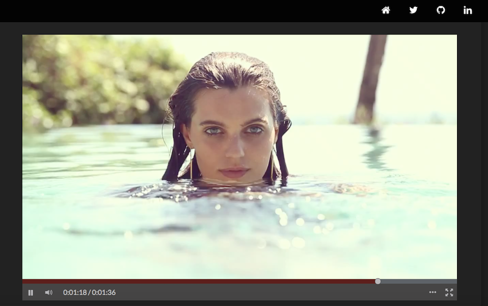
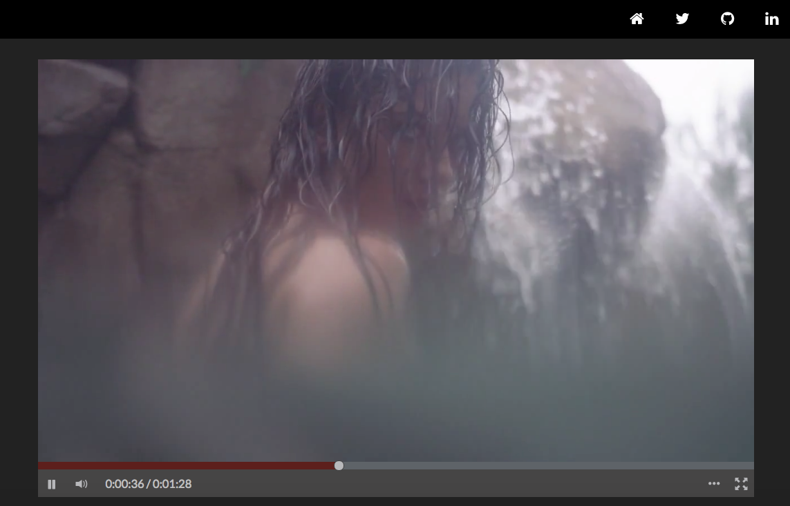
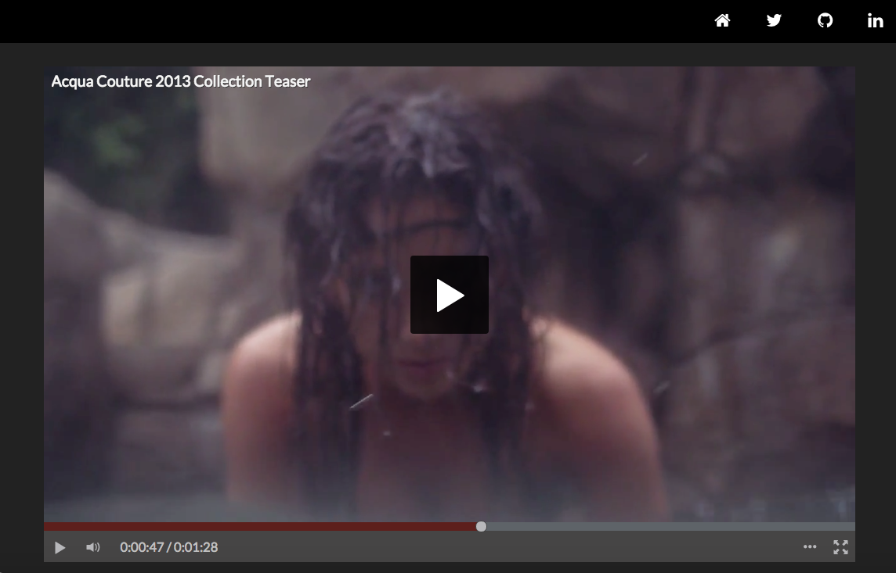
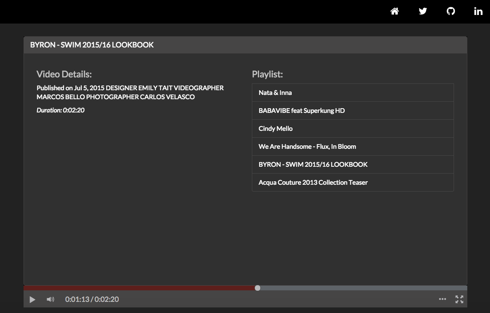

# Angular Video App
Custom HTML5 video playback built using Angular.js

[Click link to view live version of Angular Video App](http://bugsyalexander.github.io/Angular-Video-App/)

Features:
- Fully responsive
- Custom layout & UI elements
- Cross browser event handlers

Frameworks/Libraries:
- Angular
- Angular-animate
- Animate
- Bootstrap
- Bootswatch / Darkly Theme
- Jquery

